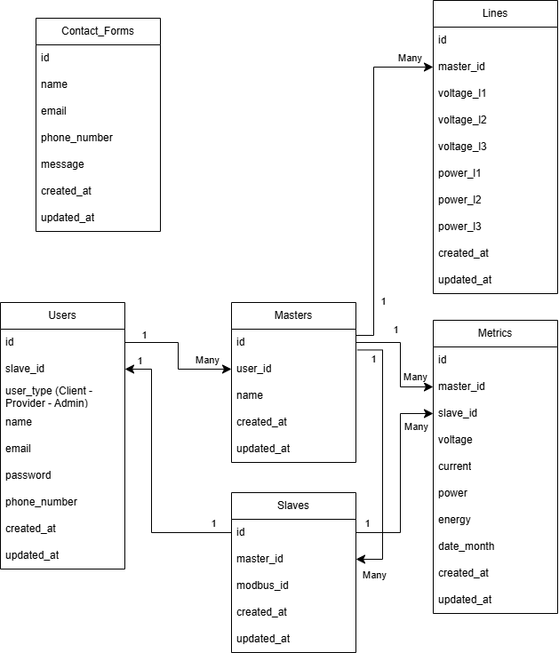

  

<!-- project overview -->

> Amp Intelligence is an IoT website that tracks the power consumption of each client and power distribution of the providers.
> 
> The website will display the data that the arduino will send to the database and the users will be able to generate AI reports for their needs.

 

<!-- System Design -->

### ER Diagram

### Component Diagram

### Flow Diagram

  

<!-- Project Highlights -->

### The Most Remarkable Features

- <b>Seamless IoT Data Ingestion:</b> The system captures and securely stores real-time energy consumption data from client devices using ESP32 microcontrollers.

- <b>AI-Powered Consumption Forecasting:</b> Advanced AI models analyze historical patterns to help energy providers anticipate demand and optimize resource allocation.

- <b>Personalized AI Optimization Plans:</b> Clients receive intelligent, data-driven strategies to optimize energy usage, reduce costs, and promote sustainability based on their consumption behaviors.

  

<!-- Demo -->

### User Screens (Mobile)

| Login screen                            | Register screen                       | Register screen                       |
| --------------------------------------- | ------------------------------------- | ------------------------------------- |
|  |  |  |

### Admin Screens (Web)

| Login screen                            | Register screen                       |
| --------------------------------------- | ------------------------------------- |
|  |  |

  

<!-- Development & Testing -->

### Add Title Here

| Services                            | Validation                       | Testing                        |
| --------------------------------------- | ------------------------------------- | ------------------------------------- |
|  |  |  |

  

<!-- Deployment -->

### Add Title Here

- Description here.

| Postman API 1                            | Postman API 2                       | Postman API 3                        |
| --------------------------------------- | ------------------------------------- | ------------------------------------- |
|  |  |  |

  

#### To test the website, here are some initial default data stored in the database:

#### Admin Users:
> <u><b>Email:</b></u> riyad@gmail.com, <u><b>Password:</b></u> password

> <u><b>Email:</b></u> nabiha@gmail.com, <u><b>Password:</b></u> password

#### Provider Users:
> <u><b>Email:</b></u> cdaoud@gmail.com, <u><b>Password:</b></u> password

> <u><b>Email:</b></u> nour@gmail.com, <u><b>Password:</b></u> password

> <u><b>Email:</b></u> taha@gmail.com, <u><b>Password:</b></u> password

#### Client Users:
> <u><b>Email:</b></u> gheeda@gmail.com, <u><b>Password:</b></u> password

> <u><b>Email:</b></u> joe@gmail.com, <u><b>Password:</b></u> password

> <u><b>Email:</b></u> sara@gmail.com, <u><b>Password:</b></u> password
