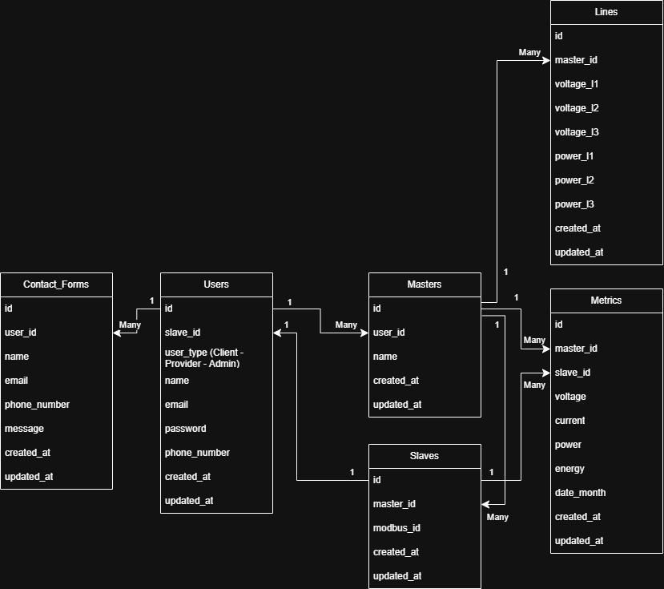

  

<!-- project overview -->

> Amp Intelligence is an IoT website that tracks the power consumption of each client and power distribution of the providers.
> 
> The website will display the data that the arduino will send to the database and the users will be able to generate AI reports for their needs.

#### To test the website, here are some initial default data stored in the database:

#### Admin Users:
> <u><b>Email:</b></u> riyad@gmail.com, <u><b>Password:</b></u> password

> <u><b>Email:</b></u> nabiha@gmail.com, <u><b>Password:</b></u> password

#### Provider Users:
> <u><b>Email:</b></u> cdaoud@gmail.com, <u><b>Password:</b></u> password

> <u><b>Email:</b></u> nour@gmail.com, <u><b>Password:</b></u> password

> <u><b>Email:</b></u> taha@gmail.com, <u><b>Password:</b></u> password

#### Client Users:
> <u><b>Email:</b></u> gheeda@gmail.com, <u><b>Password:</b></u> password

> <u><b>Email:</b></u> joe@gmail.com, <u><b>Password:</b></u> password

> <u><b>Email:</b></u> sara@gmail.com, <u><b>Password:</b></u> password

 

<!-- System Design -->

### ER Diagram

 

## System Design - Database Schema Overview
The Amp Intelligence platform utilizes a relational database schema designed to support a scalable, secure, and modular architecture for intelligent energy monitoring and user management. The schema is optimized for clarity in data ownership, role-based access, and historical data collection, ensuring robust data integrity and efficient query performance.

### Core Entities & Relationships
### 1) Users

- Centralized user management is facilitated through the Users table, which supports multiple user roles: Clients, Providers, and Admins. This enables clear segregation of access rights and responsibilities.

- The schema supports optional direct mapping between Users and Slaves, ensuring traceability of device ownership per client.

- The design ensures flexibility to support role-based data visualization and management in both the platform’s dashboard and APIs.

### 2) Masters & Slaves

- The Masters table represents the core energy monitoring controllers, typically installed and managed by provider entities (linked via user_id).

- Each Master can manage multiple Slaves, which represent individual monitored assets or devices. The Slaves are associated back to the Masters and can also link directly to Users (clients) via the slave_id field in the Users table, ensuring traceability of monitored assets.

### 3) Metrics & Lines

- The Metrics table serves as the historical data ledger, storing essential telemetry such as voltage, current, power, and energy per Slave and Master device, organized on a monthly basis for performance optimization.

- The Lines table provides additional granularity by storing per-phase measurements (L1, L2, L3) and is directly linked to the Masters. This supports detailed line-level diagnostics, crucial for industrial-grade energy analytics.

### 4) Contact Forms

- User-generated communication is handled by the Contact_Forms table, ensuring that feedback, support requests, and queries are traceable to specific users.

- This supports seamless user support workflows and ensures accountability.

### 5) Design Principles
- Scalability & Modularity: The schema supports multi-tenant architecture, where Providers can manage multiple Masters and Clients can own specific Slaves. This allows the platform to scale horizontally by simply extending these relationships.

- Data Integrity & Traceability: All critical records are timestamped (created_at, updated_at), supporting full audit trails. Foreign key relationships ensure data consistency across all levels.

- Performance Considerations: Metrics are decoupled into Metrics and Lines, optimizing for both high-frequency telemetry capture and in-depth line-level analysis without query performance degradation.

### Summary
This ERD lays the foundation for Amp Intelligence’s core platform services by enabling structured, efficient, and secure energy data management while providing flexibility for future expansion, including integrations with third-party platforms, advanced reporting engines, and AI-driven anomaly detection systems.

 

<!-- Project Highlights -->

### The Most Remarkable Features

- <b>Seamless IoT Data Ingestion:</b> The system integrates with ESP32 microcontrollers to capture real-time energy consumption data from client devices. This data is securely transmitted and stored in the platform's centralized database, ensuring accurate and continuous monitoring of power usage.

- <b>AI-Powered Consumption Forecasting for Providers:</b> Leveraging advanced AI models, the platform provides energy providers with predictive analytics based on historical consumption patterns. These insights enable providers to anticipate client power demand, enhance load management, and optimize resource allocation.

- <b>Personalized AI Optimization Plans for Clients:</b> The system offers clients intelligent, data-driven power usage plans. By analyzing past consumption behaviors, the AI recommends actionable strategies to optimize energy usage, reduce costs, and promote sustainable consumption habits.

  

<!-- Demo -->

### User Screens (Mobile)

| Login screen                            | Register screen                       | Register screen                       |
| --------------------------------------- | ------------------------------------- | ------------------------------------- |
|  |  |  |

### Admin Screens (Web)

| Login screen                            | Register screen                       |
| --------------------------------------- | ------------------------------------- |
|  |  |

  

<!-- Development & Testing -->

### Add Title Here

| Services                            | Validation                       | Testing                        |
| --------------------------------------- | ------------------------------------- | ------------------------------------- |
|  |  |  |

  

<!-- Deployment -->

### Add Title Here

- Description here.

| Postman API 1                            | Postman API 2                       | Postman API 3                        |
| --------------------------------------- | ------------------------------------- | ------------------------------------- |
|  |  |  |

  
