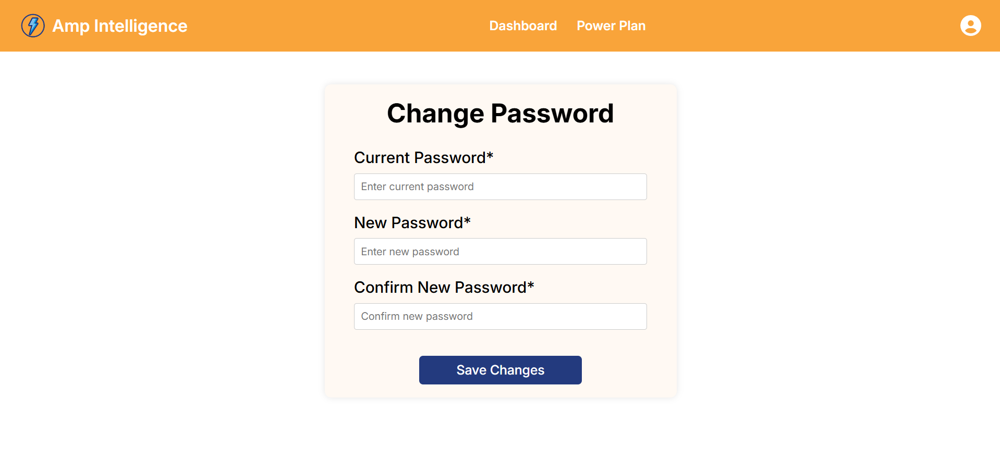

  

<!-- project overview -->

> Amp Intelligence is an IoT website that tracks the power consumption of each client and power distribution of the providers.
> 
> The website will display the data that the arduino will send to the database and the users will be able to generate AI reports for their needs.

 

<!-- System Design -->

### ER Diagram

### Component Diagram

  

<!-- Project Highlights -->

### The Most Remarkable Features

- <b>Seamless IoT Data Ingestion:</b> The system captures and securely stores real-time energy consumption data from client devices using ESP32 microcontrollers.

- <b>AI-Powered Consumption Forecasting:</b> Advanced AI models analyze historical patterns to help energy providers anticipate demand and optimize resource allocation.

- <b>Personalized AI Optimization Plans:</b> Clients receive intelligent, data-driven strategies to optimize energy usage, reduce costs, and promote sustainability based on their consumption behaviors.

### Features Highlight

  

<!-- Demo -->

### Landing Screens

| Landing Screen                            | Login screen                       |
| --------------------------------------- | ------------------------------------- |
|  |  |

### Client Screens

| Client Dashboard screen                            | Client Report screen                       |
| --------------------------------------- | ------------------------------------- |
|  |  |

| Client Profile screen                            | Contact Us screen                       |
| --------------------------------------- | ------------------------------------- |
|  |  |

### Provider Screens

| Provider Dashboard screen                            | Provider Report screen                       |
| --------------------------------------- | ------------------------------------- |
|  |  |

| Provider Show Users screen                            | Provider Edit Profile screen                       |
| --------------------------------------- | ------------------------------------- |
|  |  |

### Admin Screens

| Admin View All Providers screen                            | Admin View All Contact Messages screen                       |
| --------------------------------------- | ------------------------------------- |
|  |  |

  

<!-- Development & Testing -->

### Project Box Design

This box is a demostration of a power room that contain elecrical wire lines and the microcontroller is connected to the circuit.

I used for this project ESP32 DevKit V1. It is based on the ESP32 microcontroller that boasts Wifi, Bluetooth, Ethernet and Low Power support all in a single chip.

| Power Box 1                             | Power Box 2                       | Power Box 3                        |
| --------------------------------------- | ------------------------------------- | ------------------------------------- |
|  |  |  |

#### Postman API Documentation

- You can check the full API documentation using this [link](https://documenter.getpostman.com/view/42830816/2sB2qXji4H).

### Code Test Cases

| Test Case                           | Test Case                       |
| --------------------------------------- | ------------------------------------- |
|  |  |

|Test Case                           | Test Case                       |
| --------------------------------------- | ------------------------------------- |
|  |  |

### GitHub Testing Pull Request

| GitHub Testing Pipeline                           | GitHub Pull Request                      |
| --------------------------------------- | ------------------------------------- |
|  |  |

  

<!-- AI-Power APP -->

### Prism OpenAI Intengration

- Prism is a powerful Laravel package for integrating Large Language Models (LLMs) into your applications.

| Prism Provider Prompt                           | Prism Client Prompt                      |
| --------------------------------------- | ------------------------------------- |
|  |  |

| Prism Function Call                           | Controller                      |
| --------------------------------------- | ------------------------------------- |
|  |  |

| Routes                           | Testing Pipeline                      |
| --------------------------------------- | ------------------------------------- |
|  |  |

### Server Response with Database Indexing

- Provider user AI generated response time difference

| Postman API Before Indexing (22.28s)                           | Postman API After Indexing (15.5s)                      |
| --------------------------------------- | ------------------------------------- |
|  |  |

### Server Response with Database Indexing

- Client user AI generated response time difference

| Postman API Before Indexing (17s)                           | Postman API After Indexing (8.28 s)                      |
| --------------------------------------- | ------------------------------------- |
|  |  |

| Users Table user_type indexed                           | Metrics Table slave_id indexed                      |
| --------------------------------------- | ------------------------------------- |
|  |  |

  

<!-- Deployment -->

### Deployment Diagram

### EC2 Docker containers deployment

| Deployment Pipeline 1                            | Deployment Pipeline 2                       |
| --------------------------------------- | ------------------------------------- |
|  |  |

| Deployment Pipeline 3                            | Deployment Pipeline 4                       |
| --------------------------------------- | ------------------------------------- |
|  |  |

| GitHub Deployment Pipeline Success                            | EC2 Instance docker deployed                       |
| --------------------------------------- | ------------------------------------- |
|  |  |

| EC2 Node Server Logs                            | ESP32 Serial Monitor Output                       |
| --------------------------------------- | ------------------------------------- |
|  |  |

| AWS S3 Bucket React files                            | S3 bucket public IP website                       |
| --------------------------------------- | ------------------------------------- |
|  |  |

 

#### To test the website, here are some initial default data stored in the database:

#### Admin Users:
> <u><b>Email:</b></u> riyad@gmail.com, <u><b>Password:</b></u> password

> <u><b>Email:</b></u> nabiha@gmail.com, <u><b>Password:</b></u> password

#### Provider Users:
> <u><b>Email:</b></u> cdaoud@gmail.com, <u><b>Password:</b></u> password

> <u><b>Email:</b></u> nour@gmail.com, <u><b>Password:</b></u> password

> <u><b>Email:</b></u> taha@gmail.com, <u><b>Password:</b></u> password

#### Client Users:
> <u><b>Email:</b></u> gheeda@gmail.com, <u><b>Password:</b></u> password

> <u><b>Email:</b></u> joe@gmail.com, <u><b>Password:</b></u> password

> <u><b>Email:</b></u> sara@gmail.com, <u><b>Password:</b></u> password
