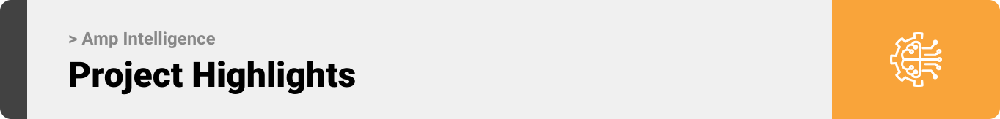
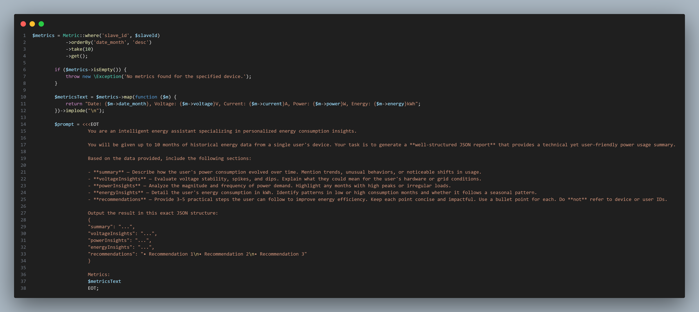

  

<!-- project overview -->

> Amp Intelligence is an IoT website that tracks the power consumption of each client and power distribution of the providers.
> 
> The website will display the data that the arduino will send to the database and the users will be able to generate AI reports for their needs.

 

<!-- System Design -->

### ER Diagram

### Component Diagram

### Flow Diagram

### Project Box Design

| Power Box 1                             | Power Box 2                       | Power Box 3                        |
| --------------------------------------- | ------------------------------------- | ------------------------------------- |
|  |  |  |

  

<!-- Project Highlights -->

### The Most Remarkable Features

- <b>Seamless IoT Data Ingestion:</b> The system captures and securely stores real-time energy consumption data from client devices using ESP32 microcontrollers.

- <b>AI-Powered Consumption Forecasting:</b> Advanced AI models analyze historical patterns to help energy providers anticipate demand and optimize resource allocation.

- <b>Personalized AI Optimization Plans:</b> Clients receive intelligent, data-driven strategies to optimize energy usage, reduce costs, and promote sustainability based on their consumption behaviors.

  

<!-- Demo -->

### Client Screens (Web)

| Login screen                            | Register screen                       |
| --------------------------------------- | ------------------------------------- |
|  |  |

### Provider Screens (Web)

| Login screen                            | Register screen                       |
| --------------------------------------- | ------------------------------------- |
|  |  |

### Admin Screens (Web)

| Login screen                            | Register screen                       |
| --------------------------------------- | ------------------------------------- |
|  |  |

  

<!-- Development & Testing -->

### Code Test Cases

| Test Case                            | Test Case                       | Test Case                        |
| --------------------------------------- | ------------------------------------- | ------------------------------------- |
|  |  |  |

### GitHub Testing Pull Request

| GitHub Testing Pipeline                            | GitHub Pull Request                       | Testing Output                       |
| --------------------------------------- | ------------------------------------- | ------------------------------------- |
|  |  |  |

  

<!-- AI-Power APP -->

### OpenAI Intengration

- Description here.

| Prism Function Call                            | Prism Client Prompt                       | Prism Provider Prompt                        |
| --------------------------------------- | ------------------------------------- | ------------------------------------- |
|  |  |  |

### Server Response with Database Indexing

- Provider user response time difference

| Postman API Before Indexing                            | Postman API After Indexing                       |
| --------------------------------------- | ------------------------------------- |
|  |  |

### Server Response with Database Indexing

- Client user response time difference

| Postman API Before Indexing                            | Postman API After Indexing                       |
| --------------------------------------- | ------------------------------------- |
|  |  |

  

<!-- Deployment -->

### EC2 Docker containers deployment

- You can check the full API documentation using this [link]().

| Deployment Pipeline Sample                            | GitHub Deployment Pipeline Success                       | EC2 Instance docker deployed                        |
| --------------------------------------- | ------------------------------------- | ------------------------------------- |
|  |  |  |

  

#### To test the website, here are some initial default data stored in the database:

#### Admin Users:
> <u><b>Email:</b></u> riyad@gmail.com, <u><b>Password:</b></u> password

> <u><b>Email:</b></u> nabiha@gmail.com, <u><b>Password:</b></u> password

#### Provider Users:
> <u><b>Email:</b></u> cdaoud@gmail.com, <u><b>Password:</b></u> password

> <u><b>Email:</b></u> nour@gmail.com, <u><b>Password:</b></u> password

> <u><b>Email:</b></u> taha@gmail.com, <u><b>Password:</b></u> password

#### Client Users:
> <u><b>Email:</b></u> gheeda@gmail.com, <u><b>Password:</b></u> password

> <u><b>Email:</b></u> joe@gmail.com, <u><b>Password:</b></u> password

> <u><b>Email:</b></u> sara@gmail.com, <u><b>Password:</b></u> password
